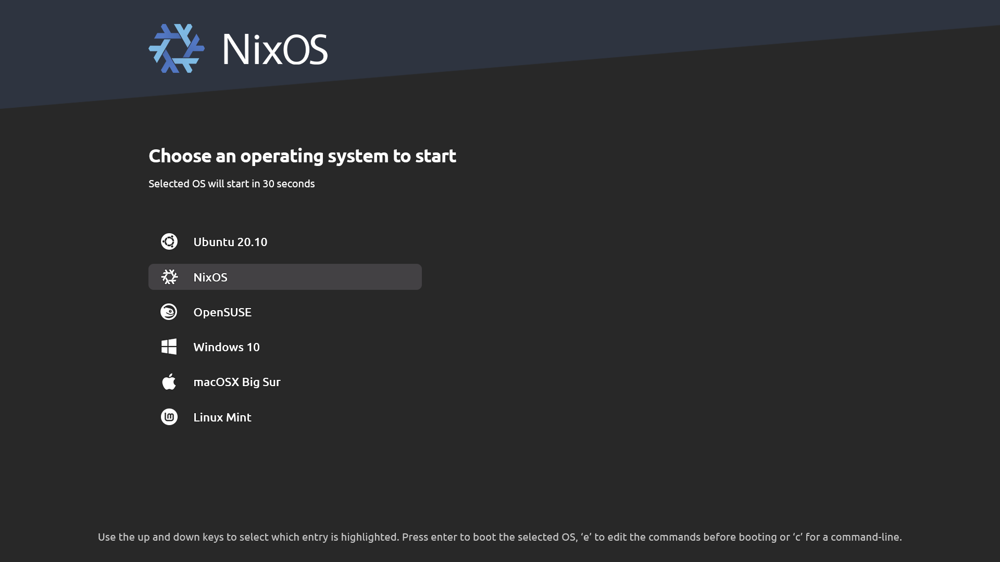
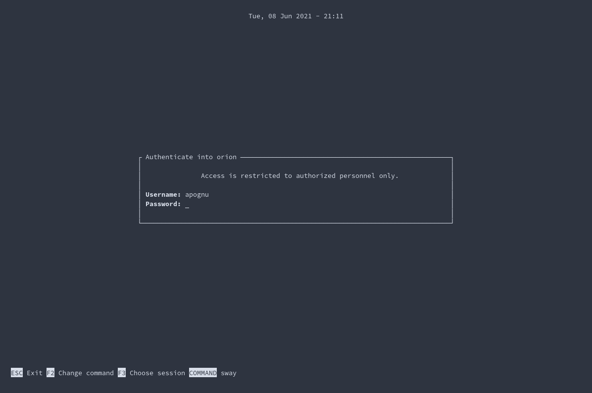

```bash
sudo nix-channel --add https://nixos.org/channels/nixos-unstable nixos
sudo nix-channel --add https://github.com/nix-community/home-manager/archive/master.tar.gz home-manager
sudo nix-channel --update
```

# NOTE
see [constants](./home/constants.example.nix)

# Images
## GRUB

## Tuigreet
